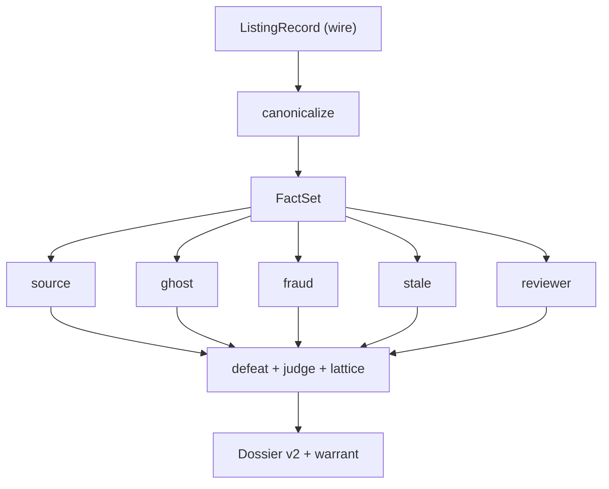

# JobzMall Transparency Algorithm

This repository contains the core code for the **JobzMall Transparency** commitment: the public rules that decide what a job listing may claim — not which candidate to hire, and not which job to rank first.

A listing is compiled to typed facts. Independent analyzers emit claims. A least-commitment judge projects a deterministic **Job Posting Nutrition Label** and a disposition: show, disclose, restrict, or drop. The dossier records why.

The public library is [transparency.jobzmall.com](https://transparency.jobzmall.com). Sample dossiers there are still hand-authored. This tree is what we will compile them with; it is not yet the production compile path.

This is not a ranking mixer. There is no candidate pipeline, no blending stage, no viewer-specific score.

## How a listing is labeled

`label-mixer` is the CLI. `jm-engine::compile` is the compiler.

1. Resolve `as_of` from the listing (or `--now`). No wall clock on the default path.
2. Canonicalize dates, URLs, apply targets, ATS class.
3. Extract a `FactSet`. A fact that is not extracted does not exist.
4. Run source, ghost, fraud, stale, and reviewer analyzers. They do not read each other.
5. Apply undercutters and rebuttals. Empty crawl coverage undercuts `source_absent`, so another criterion may still raise a ghost. A closed job rebuts every ghost claim, which bars the head outright.
6. Judge under least commitment. Join serving obligations on `Show ⊑ Disclose ⊑ Restrict ⊑ Drop`.
7. Project the ten Nutrition Label fields. A missing fact is an explicit value, not a blank.
8. Emit a warrant (which heads survived, and which were defeated) and an aftermath (serve + correction hint).

Ingest runs on its own schedule. This tree compiles a stored record; it does not crawl.



See [`docs/CALCULUS.md`](docs/CALCULUS.md) for the formal rules.

## Packages

| Package | What it does |
| --- | --- |
| [`kernel/`](kernel/) | Facts, claims, defeaters, judge, lattice, warrant |
| [`extract/`](extract/) | Date / URL / apply-target parse + fact extraction |
| [`engine/`](engine/) | The compiler driver |
| [`label-mixer/`](label-mixer/) | CLI over the compiler |
| [`sources/`](sources/) | Agreement over ingest + ATS + career + JobzMall signals |
| [`ghost/`](ghost/) | Hedged verdict; structural claims cannot propose `likely` |
| [`fraud/`](fraud/) | Four log-odds heads, negation window, brand impersonation |
| [`stale/`](stale/) | HTTP family + sync lag + missed-sync budget |
| [`nutrition/`](nutrition/) | The ten-field Job Posting Nutrition Label |
| [`enforcement/`](enforcement/) | Reviewer recommendation |
| [`public-report/`](public-report/) | Aggregate counts |
| [`params/`](params/) | Published defaults |
| [`common/`](common/) | Wire types and the dossier schema |

## Source kinds

A source label is provenance, not a verdict. Below the confidence floor — or when two signals disagree at the same confidence — the kind is `unknown`. We do not invent a source.

| Kind | Meaning |
| --- | --- |
| `live` | Official career page (or equivalent employer-controlled channel) |
| `marketplace` | Organization posted or claimed the role on JobzMall |
| `indexed` | Employer-controlled ATS / board |
| `unknown` | Confidence below the floor, or unresolved disagreement |

## Three failures, three responses

| Failure | What it is | Response |
| --- | --- | --- |
| **Fraud** | Criminal intent: steal money, data, or identity | **Enforcement** — restrict automatically; drop only after review |
| **Ghost job** | Real employer, no active near-term vacancy | **Disclosure** |
| **Stale job** | Real opening that stayed online after it closed | **Synchronization**, then disclose if still served |

A Live Job can still become a ghost or go stale between syncs.

## Ghost detection

The verdict is time-dependent and compiled when the dossier is built, never stored as a standing score.

Two tiers:

- **Structural** — `evergreen_posting`, `source_absent`, `repost_reset`. Shape of the posting. Type-capped at `possible`.
- **Outcome** — `silent_applications`, `user_reports`. What happened to people.

Witness identity: exact if `outcome_witness_ids` are present; otherwise an inclusion interval. `likely` reads the **lower** bound.

Published gates:

- `convergence = 2` criteria to say anything from structure alone
- `contributor_gate = 2` distinct people for `likely`
- `source_absent` stamps older than 14 days are undercut
- `evergreen_age_days = 270` before an ingest evergreen hint stands alone, or before "always hiring" language stands without a date reset
- a closed job rebuts every ghost claim
- an empty career-page crawl undercuts `source_absent` (it is **no coverage**)

Outputs: `none` | `possible` | `likely`, plus which criteria survived (`N of 5`), plus the witness interval.

## Nutrition Label

Every listing should wear these fields on the posting — not in a tooltip, not after apply. See [`docs/NUTRITION_LABEL.md`](docs/NUTRITION_LABEL.md).

| Field | Meaning |
| --- | --- |
| Source | Where we obtained the posting |
| Employer relationship | Official, claimed, or indexed |
| Original publication date | When the role first appeared |
| Last verification date | When we last heard from the source |
| Application destination | Where the information actually goes |
| Work arrangement | On-site, hybrid, remote — as stated |
| Compensation status | Published, range, or not disclosed |
| AI involvement | Whether AI generated or modified any description |
| Current-opening status | Open, stale, or unknown |
| Reporting mechanism | How to flag the listing and get a reply |

Current-opening status is derived, not stored:

- ghost `none` and source live → `open`
- ghost `possible` or `likely` → `unknown` (disclosed separately)
- stale `closed_at_source` → `stale`
- anything else → `unknown`

A 2xx counts as live only against a sync lag we actually measured. A listing whose stamps do not parse has no freshness reading, and no reading is never `open`.

## Disposition

```
show       the label is enough
disclose   ghost, stale, or source-not-found — show the listing and the signal
restrict   withheld from recommendations; still inspectable
drop       human-confirmed fraud only
```

Join is commutative. Restrict beats disclose regardless of which analyzer ran first.

## Configuration

Tunable values live in [`params/src/lib.rs`](params/src/lib.rs). Fraud restrict thresholds are omitted from the public defaults (`null`) so the published tree cannot be used to map the detector’s boundary. Set a local policy file with `Params::from_policy_file` when you need them; it may set only the fields it overrides, and an unknown field is an error rather than a silent default.

Ghost gates, evergreen age, sync-lag hours, the fraud negation window, and nutrition fields stay public.

[`docs/PARAM_CHANGE.md`](docs/PARAM_CHANGE.md) shows what a parameter change looks like in git.

## Out of scope here

- Production crawl fleet and store wiring
- Exact fraud restrict thresholds
- Production classifier prompts
- Extra high-recall fraud rules used in production
- Job ranking or people-ranking of any kind

Those extras may only **restrict**. They cannot drop a listing, invent a source, or blend fraud / ghost / stale into one score. Drop, source kind, and the Nutrition Label stay in this tree.

The public contract is the Nutrition Label on the posting, the Ads Transparency dossier, and the warrant.

## Principles

- This file is the commitment. If production disagrees with it, this file is wrong.
- Fraud, ghost, and stale stay separate. Combining them hides a ghost as “low quality” or a scam as “stale.”
- A listing’s scores do not depend on which other listings are scored with it.
- The projector always emits ten fields. Disposition is a lattice, not a first-match rule list.
- `unknown`, `source_not_found`, and `status_uncertain` are valid. A miss must not become “open.”
- Auto may restrict. Only reviewers drop fraud.
- This repository never predicts whether to hire a person.
- New analyzers are additive: emit claims, do not call other analyzers.

## Running

```bash
cargo test --workspace
cargo run -p label-mixer -- label-mixer/fixtures/stripe-staff-engineer.json
cargo run -p label-mixer -- --dir label-mixer/fixtures
```

Synthetic listings (no production data):

```bash
python3 reference/world_listings.py --out /tmp/jm-synth --n 12
cargo run -p label-mixer -- --dir /tmp/jm-synth
```

## License

Licensed under the Apache License 2.0. See [LICENSE](LICENSE).
